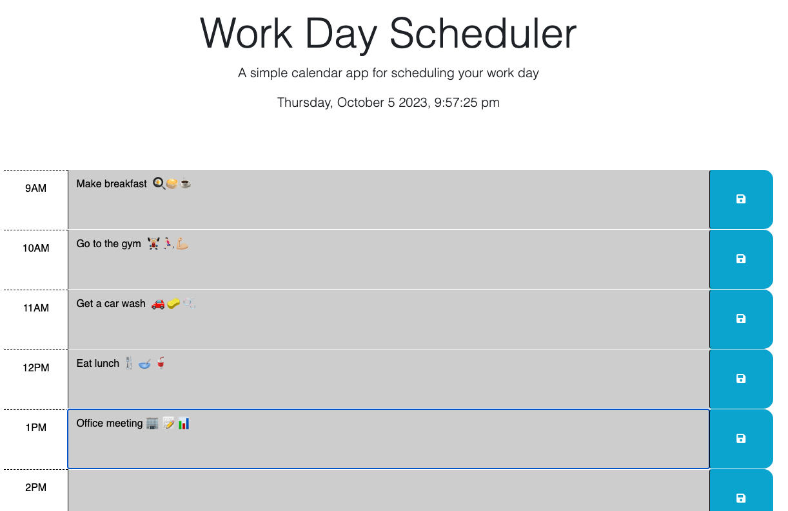

# Day Scheduler Project

## Description

In this project, I designed a simple daily task scheduler. The simple scheduler contains a date and time element which was achieved utilizing the day.js utility. The scheduler presents nine text input boxes that each correspond to the hours between 9am and 5pm (see screenshot). When a user enters information in these boxes, the input along with the corresponding hour is logged to local storage. In addtion, there was JavaScript code added that utilized the jQuery library to provide some dynamic features, specifically the adding and removal of classes to apply different CSS styling. Essentially all text boxes with correspnding times that are in the past will be given a grey color, the text box that corresponds to the current hour will be given a background color of red, and text boxes of corresping times that are in the future will be given a background color of green.

This project provided an opportunity to develop a simple yet useful application as it allows a person to keep track of their daily tasks during the work day. I was able to better understand how JS and jQuery could be leverage together to provide additonal functionality to a application.

**View deployed link [HERE.](https://aaront080.github.io/Day-scheduler-project/)**

## Screenshot

